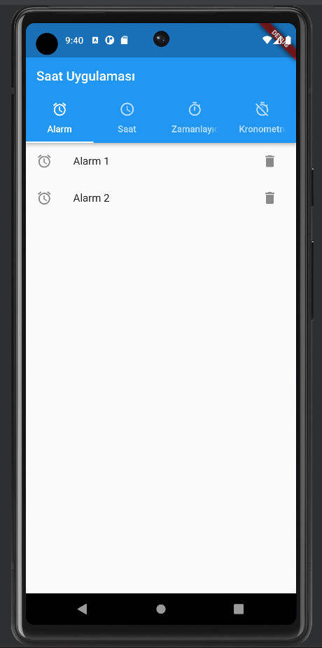
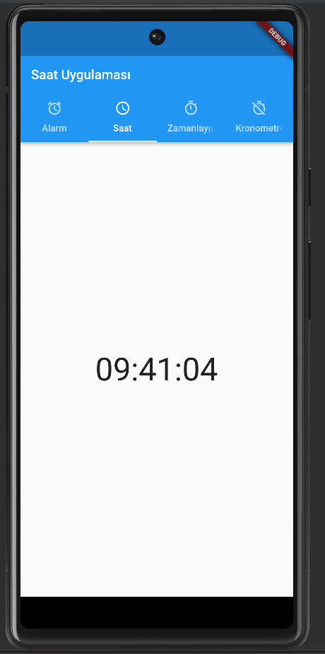
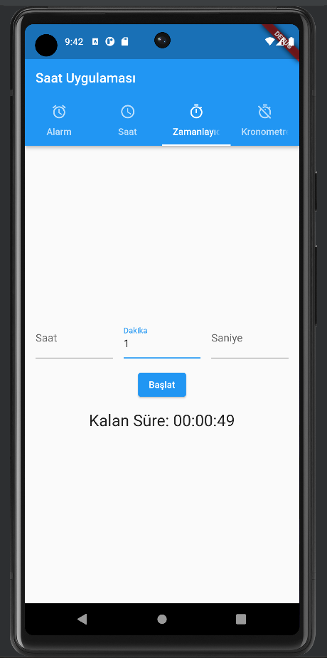
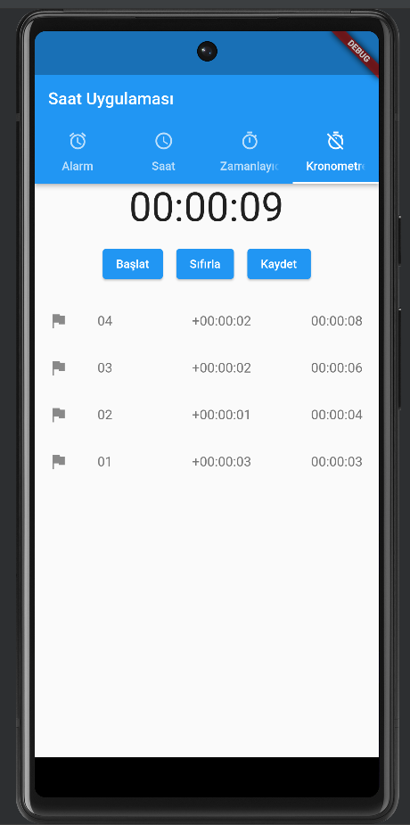

# Saat Uygulaması

Bu Flutter projesi, dört farklı sekme içeren bir saat uygulamasını içermektedir: 
Alarm, Saat, Zamanlayıcı ve Kronometre.

## Özellikler

### Alarm Sekmesi
Alarm sekmesi, kullanıcının belirlediği alarm saatlerini gösterir. 

### Saat Sekmesi
Saat sekmesi, anlık olarak güncellenen bir saat gösterir. 
Saatin güncellenmesi için her saniye bir zamanlayıcı kullanılmıştır. 

### Zamanlayıcı Sekmesi
Zamanlayıcı sekmesi, kullanıcının belirlediği süreyi geri sayan bir zamanlayıcı içerir. 
Kullanıcı, saat, dakika ve saniye bilgilerini girebilir ve ardından "Başlat" düğmesine basarak geri sayımı başlatabilir. 
Geri sayım tamamlandığında bir bildirim gösterilir.

### Kronometre Sekmesi
Kronometre sekmesi, kullanıcının geçen süreyi takip etmesine olanak tanır. 
"Başlat/Durdur" düğmesi ile kronometreyi başlatabilir veya durdurabilir, 
"Sıfırla" düğmesi ile kronometreyi sıfırlayabilir ve 
"Kaydet" düğmesi ile geçen süreyi kaydedebilirsiniz. 
Kaydedilen süreler liste halinde görüntülenir.

## Kurulum

1. Dart ve Flutter'ın yüklü olduğundan emin olun.
2. Projeyi klonlayın: `git clone https://github.com/Bora35/SaatUygulamasi.git`
3. Projeketin ana dizinine gidin: `cd SaatUygulamasi`
4. Bağımlılıkları yükleyin: `flutter pub get`
5. Uygulamayı çalıştırın: `flutter run`

## Ekran Görüntüsü

